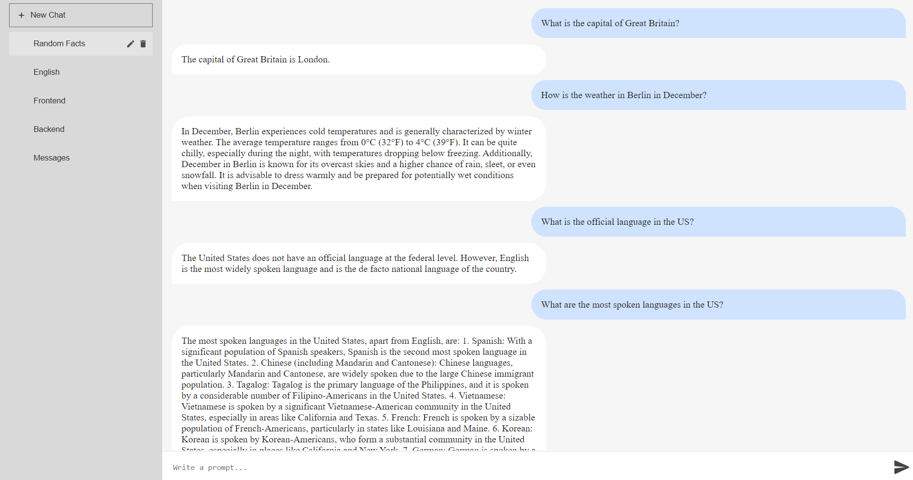

# Chat GPT Messenger
The goal of the project was to built Chat-GPT Messenger.

__Demo:__ https://tanyaignatenko.github.io/Chat-GPT-Messenger/

Features:
- Sending messages to Chat-GPT without limits.
- Creation of multiple chats with different names.
- Saving of a message history locally in a browser in IndexedDB.
- Deletion of messages.
- Deletion of chats.

Technologies: React, TypeScript, IndexedDB, HTML, CSS

